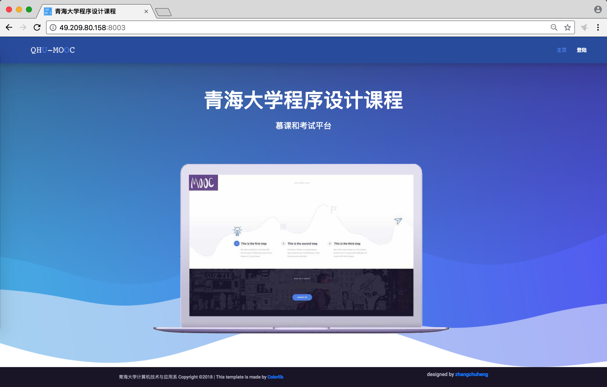
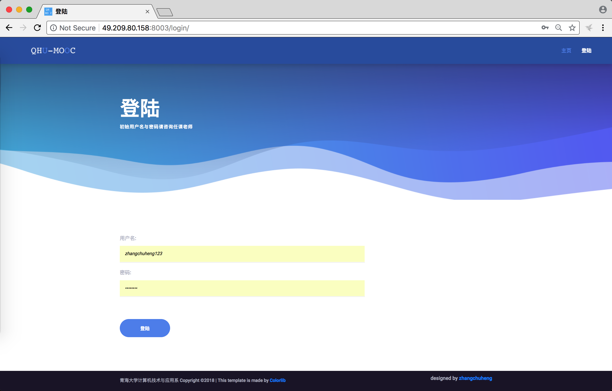
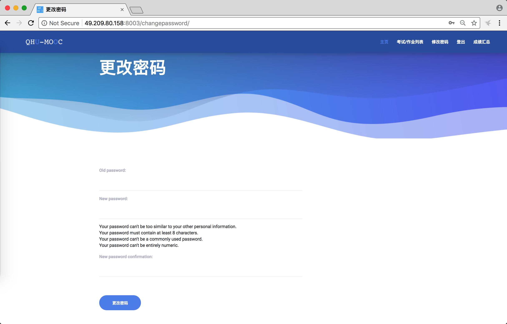
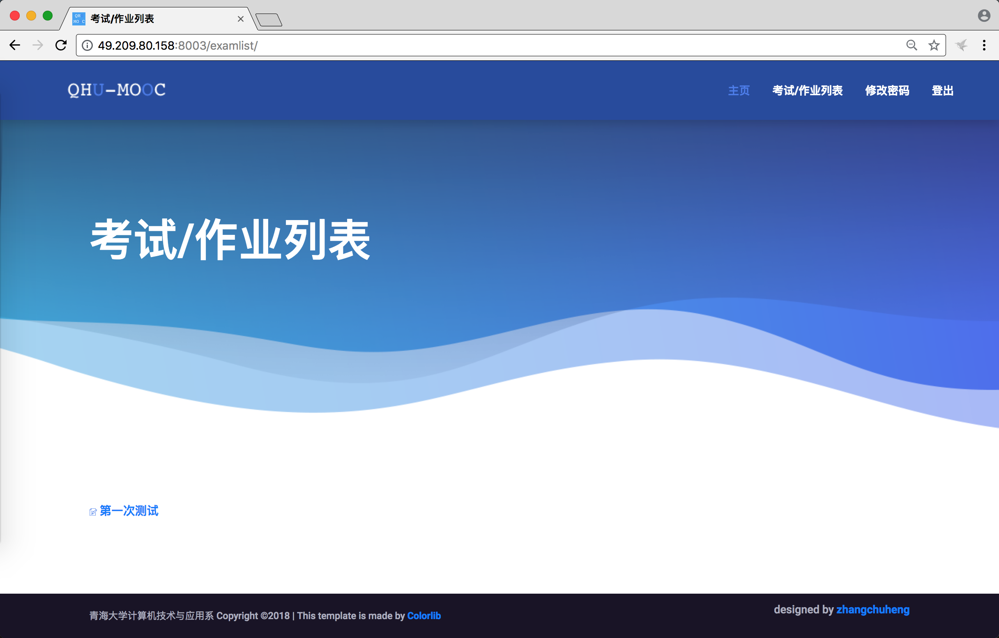
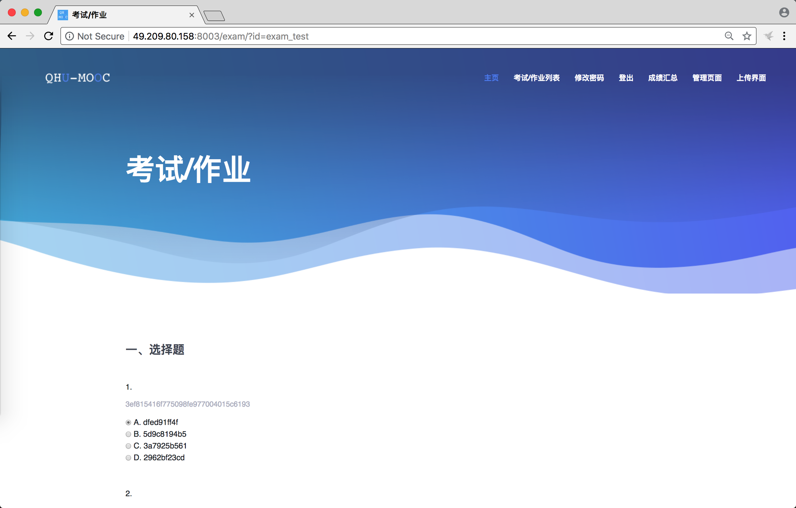
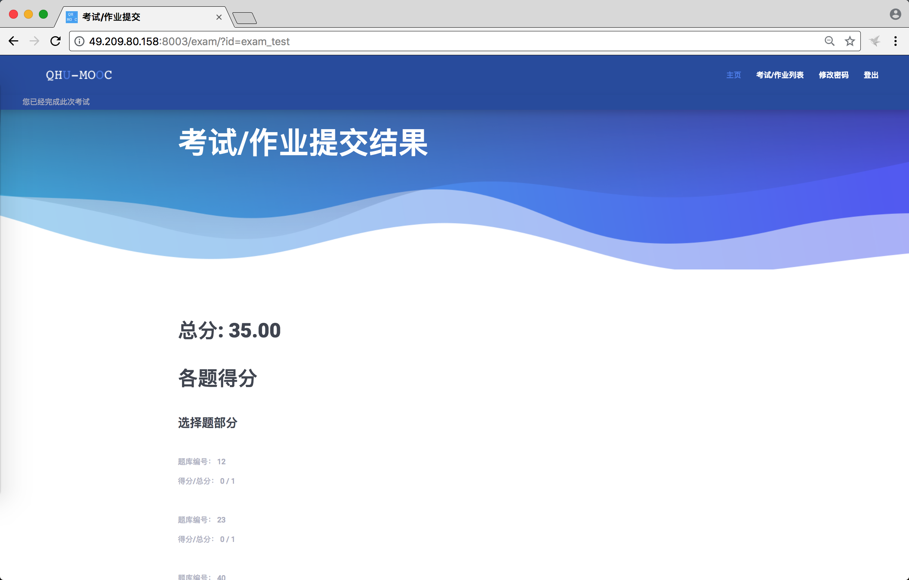
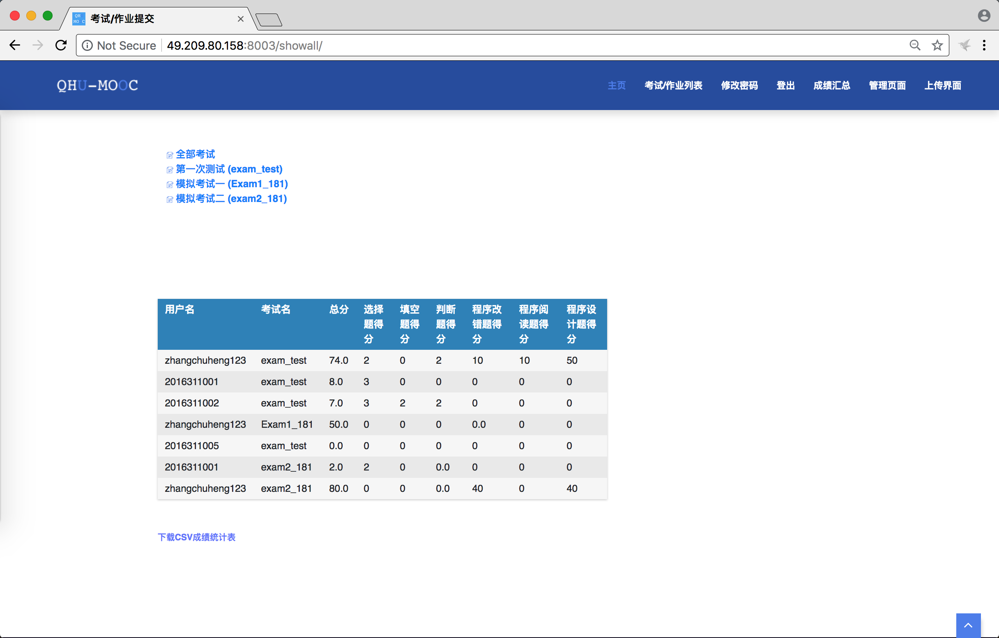
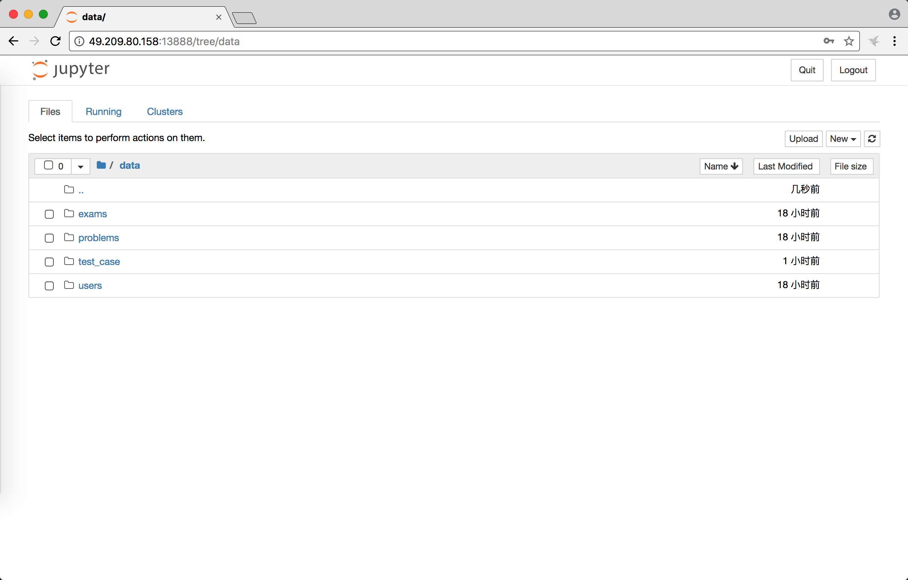

# QHU-MOOC-v1

## 简述

该项目是在青海大学暑期社会实践期间的工作，任务由青海大学计算机技术与应用系提出，主要目的是为其程序设计课程设计一套系统，供学生考试和作业使用。限于实践的时间，本系统旨在使用最为简单的方式来实现青海大学所需功能，并且为后续的拓展提供良好的基础。

## 功能

本项目主要实现所需的以下功能：

* 用户管理：
    - 教师可以批量导入学生的账号和初始密码
    - 学生可以自行修改自己的密码
    - 教师可以对整体进行管理，学生只能查看到自己班级所属的考试（作业）并且参加考试（作业）
* 核心功能：
    - 实现选择题、填空题、判断题、程序改错题、程序阅读题和程序设计题等六种题型
    - 每种题型可以设立相应的题库，每次考试（作业）都从提供中选取内容相符的题目进行随机组卷
    - 实现题目的自动判题，其中程序改错题和程序设计题需要运行学生提交的代码，通过测试样例的形式进行评卷；评卷按照测试点给分（即IO模式，非ACM模式）
    - 对于测试样例编译未通过或者结果不正确的学生，可以对其手动阅卷（暂未实现）
    - 教师能够查看学生的考试成绩，并且批量导出
* 非核心功能：
    - 界面友好整洁
    - 题目显示清晰，教师操作方便
    
## 前期调研与相关工作

本系统的难点在于

1. 后台需要调用OnlineJudge进行判题；
2. 需要有一个可靠的框架来实现前后端的逻辑；

对于第一个难点，由于其中涉及到各类编译器配置以及对于提交程序的安全配置（为了不让用户提交的有害代码的运行损害服务器），经过调研，认为自己进行独立开发十分困难，因此打算选取网上已有的开源方案。

我们调研到的第一个框架是[HUSTOJ](https://github.com/zhblue/hustoj)，该框架的判题后端是使用C++开发的一个服务器进程，该进程对于服务器中MySQL中的某一个表进行轮询，当发现新的用户提交代码的时候就对其进行编译运行并与相应测试点标准输出进行比对。该框架的网页部分使用PHP开发，实现了一个OJ系统的各类功能，包括题目展示、用户管理、代码提交、代码测评、组织比赛等。我们使用的时候遇到的问题是，后台的判题进程挂起之后并不能正常地进行判题，由于本人对于C++以及PHP都不是很熟悉，因此放弃了该框架。

我们调研到的第二个框架是[xuejing80's HUSTOJ](https://github.com/xuejing80/hustoj)（其实际运行的平台[南京邮电大学程序设计类课程作业平台](https://c.njupt.edu.cn)），该框架后台判题服务仍然基于HUSTOJ，只不过网页展示部分使用了Django框架。经过对其源码的研读，认为其目的和青海大学计算机系这边的目标一致，所实现的功能和这边的需求重合度较高。再加上本人对于python比较熟悉，因此前期决定在此项目基础上进行开发。在实际部署之后遇到了用户无法注册、判题机无法运行、测试用例无法上传等问题。由于系统较为复杂，本人无法在短时间内进行消化分析，并且判题机的数据库轮询机制使得开发调试较为困难，因此也放弃了这个框架。

经过康路师兄的推荐，我们找到了第三个框架[QingdaoU's OnlineJudge](https://github.com/QingdaoU/OnlineJudgeDeploy)。基于以下考虑，我们最后使用了该框架作为判题机后端：

1. 该框架基于python开发，其自带的网页部分也是用Django开发，个人较为熟悉；
2. 其机制为server-client模式，判题机与网站系统相互独立，模块化调试部署较为容易；
3. 相比于HUSTOJ，提供了较为详细的[JudgeServer API文档](https://docs.onlinejudge.me/#/judgeserver/api)；
4. 使用了docker进行部署，一键完成，减小部署配置不兼容导致失败的可能性；

由于其QingdaoU OnlineJudge的网站部分的目标主要是进行OJ的训练和比赛，和我们的需求不符，因此，对于网站部分我决定使用Django从头开始进行开发。

## 框架设计

限于时间，如果题库的管理和上传、用户的管理、测试点数据的管理和上传等都需要在网页端实现的话，开发量比较大，因此这里暂且主要采用文件的形式来管理题库、试题、测试点，而用户和用户的考试结果等必须使用数据库实现的才使用数据库实现。大致框架如下：

```
FILES
    + data
    |----+ problems
    |    |----+ Choice.csv                  id  description     A   B   C   D       answer          tag
    |    |----+ Completion.csv              id  description(with blank label)       answer          tag
    |    |----+ TrueOrFalse.csv             id  description                         answer          tag
    |    |----+ ProgramCorrection.csv       id  description     template            test_case_id    tag
    |    |----+ ProgramReading.csv          id  description                         answer          tag
    |    |----+ ProgramDesign.csv           id  description(include sample in/out)  test_case_id    tag
    |----+ users
    |    |----+ add_users.csv               username    password    classes     usertype
    |----+ exams
    |    |----+ exam_name.json              (num_choice point_choice tag_choice) * 5    classes
    |----+ test_cases
    |    |----+ <test_case_id>
    |    |    |----+ 1.in
    |    |    |----+ 1.out
    |    |    |----+ info

DB
    users                   username    password    class   user_type
    exam_result             username    examname   answers(JSON)     detail_scores(JSON)    score

PAGES
    index                   : after index visited check add_users.csv add and delete
    login                   : login
    logout                  : logout
    changepassword          : change password 
    examlist                : get user's class and find exams with this class
    exam?id=<examname>      : load exam / judge and show exam result for this user
    showall                 : show all the (user, exam) results for teachers
    downloadscores          : download all the (user, exam) results as csv for teachers

TEMPLATES
    mosh from https://colorlib.com/
```

## 操作说明

### 导入用户

放置``add_users.csv``到``data/users/``目录下，主要字段有``username, password, usertype, classes``，详细格式和文件编码参见``init.py``。放置在此文件夹下的文件会在第一次访问index页面之后被添加到数据库中，并且将改文件删除，**请做好文件备份**。



### 添加测试点

放置测试点文件``1.in``、``1.out``等到``data/test_case/<test_case_id>``下，在下一次访问index页面之后，会自动生成相应的该测试点info文件，info文件为判题机的主要判题依据。需要注意的是测试点应该以数字命名，并且从1开始。


### 添加考试

放置``<exam_name>.json``到``data/exams/``目录下，主要字段见``init.py``，其主要规定了各类题型的题目数量和分数。


### 管理题库

题库是在``data/problems/``目录下的六个csv文件，文件的每一行代表一个题目，具体格式见``init.py``，其主要规定了题目的ID、题干、答案、题目所属班级。
* 登陆：主页登陆之后右上角会有登陆按钮，点击即可登陆。初始密码参见教师添加的初始密码。



### 修改密码

登陆之后会有修改密码的界面，输入旧密码和新密码即可修改。



### 参加考试（作业）

登陆之后会显示考试列表，点击进入之后即可参加相应的考试；考试做题的过程中请及时点击保存，保存之后的答案在下一次该用户进入该页面的时候会自动显示，没有保存的内容再刷新页面之后会消失，**请及时保存**；点击提交之后即代表完成此次考试（作业），页面会跳转到显示分数的页面，**提交之后不能再次返回写作业**。





### 查看考试分数统计

教师登陆之后有成绩汇总页面，在此页面可以查看成绩并且下载汇总表格。




### 这里暂时只能使用Jupyter来上传管理用户、测试点、题库和考试



## 学习心得与排坑

之前没有接触过Django，这算是我Django的第一个项目，大致写一下学习心得。

首先，Django相比于Flask，所提供的功能更为完善，很多相应的模块都有现成的，使用起来较为方便。其次，Django是一个MVC的构架。个人理解，其中的Model指的数据库的结构，Django的好处是把数据库的操作封装起来了，能够直接使用python的语句把数据库当做一个类来操作；View指的是用户看到的内容，Django最常见的方式是将要展示给用户的内容装到一个dict里面，然后使用render发送给模板，由模板（templates）来决定具体展示的样式；Control指的是网页的主要逻辑部分，比较神奇的是，在我目前看到的项目中，这一部分常常是写在``view.py``里面的。

安装好Django之后开始第一个项目，新版的Django可以直接使用以下命令创建项目或者在项目内创建APP

```bash
django-admin startproject Hello
django-admin startproject backend
```

它会自动生成以下目录

```
.
├── backend
│   ├── admin.py
│   ├── apps.py
│   ├── __init__.py
│   ├── migrations
│   │   └── __init__.py
│   ├── models.py
│   ├── tests.py
│   └── views.py
├── Hello
│   ├── __init__.py
│   ├── settings.py
│   ├── urls.py
│   └── wsgi.py
└── manage.py
```

其中主项目中的``settings.py``是最为重要的配置文件，``urls.py``是对于访问连接的配置。关于他们的详细使用方式可以在网上找到。

通过``manage.py``可以实现对于该项目的管理，包括数据库的同步、迁移以及网页程序的启动等。具体地，通过``python manage.py makemigrations``可以对比数据库和我们对于数据模型的更改，生成``migrations``文件夹下面的文件，这些文件描述了需要怎样把数据库同步为现在所需的样子；通过``python manage.py migrate``可以执行刚刚生成的数据库同步语句，实现对于数据库同步；``python manage.py dbshell``可以直接进入到数据库的shell里面，个人认为比较方便的点在于省去了输入数据库密码的繁琐；``python manage.py createsuperuser``可以建立一个初始的超级用户；``python manage.py runserver 0.0.0.0:8003``可以让网站开始运行，并且只要不涉及到数据库表格式的改动，可以一边改代码一边用浏览器去访问，代码的改动立即生效，对于我这种菜鸟来说，很大程度上方便了调试。

### 问题1：QingdaoU OnlineJudge后台判题总是Wrong Answer (WA)

判题机制是使用MD5来对比输出结果和正确答案，因此我们生成info文件的时候，里面的标准答案的MD5计算方式需要跟判题机的计算方式一致，经过试验，如下计算方式能够得到一致的MD5。

```python
hashlib.md5(content.rstrip().encode('utf-8')).hexdigest()
```

### 问题2：在MySQL中使用JSONField来存储，在建立数据库的时候报错

由于我们每套试卷的题目数目不定，为了对其进行储存，我们希望直接储存JSON格式。我们查到MySQL和Django中已经支持了JSON格式的储存，因此我们直接将JSON储存到数据库中。出现了如题错误，追查原因是使用``django.contrib.postgres.fields.JSONField``的时候，生成的数据库语言中为``JSONB``类型，MySQL对应的类型直接是``JSON``。因此最后使用了``django_mysql.models.JSONField``。

### 问题3：使用哪种方式扩展User类

Django里面提供了自带的User类``django.contrib.auth.models.User``，但是由于我们需要对于User增加额外的字段，因此需要对于这个类进行扩展。主流的扩展方式有1）使用Proxy Model；2）新增一个类，并且加入一个One-to-one Link；3）继承AbstractUser或者AbstractBaseUser。参见[这个帖子](https://simpleisbetterthancomplex.com/tutorial/2016/07/22/how-to-extend-django-user-model.html)。

最先尝试的是第三种模型，但是这种模型里面在数据库中是新建的一个类，通过``createsuperuser``不能直接写到这个表里面，当然应该有扩展的方法，我们的想法还是尽可能的使用``django.contrib.auth``里面提供的现成的组件，因此弃用了该方法。

然后尝试了第一种方法，最后发现它对于MyUser类中的字段有各种限制。最后还是使用了第二种方法，在MyUser中增加一个``user = models.OneToOneField(User, on_delete=models.CASCADE)``字段。

### 问题4：数据库储存中文报错

在使用Django自带的migrate功能新建数据库之前需要先使用UTF-8编码新建数据库，``CREATE SCHEMA `jol` DEFAULT CHARACTER SET utf8;``。

### 问题5：如何reset数据库和Django Migration Files

我看了一下，migration的机制是为了在开发过程中可能对于数据库表的格式进行改变时能够对于数据库进行相应的处理，我们的项目相对来讲比较简单，因此基本上用不到其复杂的功能，我们更希望的是，每次更新之后把数据库全部删掉然后重新建立。因此我们写了``reset.sh``脚本进行此操作，在安装的时候也同样运行此脚本。参考这个[帖子](https://simpleisbetterthancomplex.com/tutorial/2016/07/26/how-to-reset-migrations.html)。

## 未来改进

1. 开发用户管理、题库管理、考试管理、测试点管理的页面，把相应的内容全部挪到网页端完成，使用数据库储存全部数据；
1. 增加考试和作业的个性化定制程度，比如可以随机组卷也可以固定选题组卷、学生可以使用不同的语言来进行编程、考试过程中的定时完成、作业中设置截止日期等；
1. 更加友好的UI设计，比如考试结果展示的更加详细、题目的展示更加友好、浏览器中的代码提供语法高亮等；
1. 增加更多慕课相关的功能，比如课程通知、课程讨论、课程笔记等；

该项目估计下一年还会继续有同学来进行，希望本项目提供了一个良好的蓝图。使用了GPL License也是希望大家一起努力把该系统做好。
